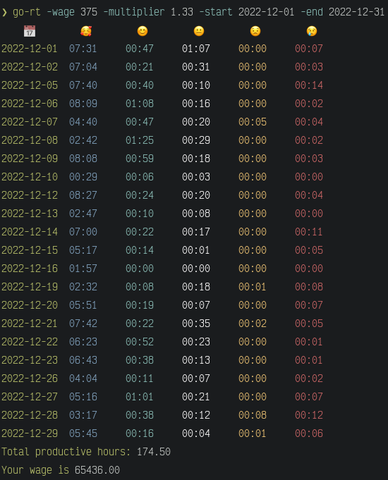

# RescueTime analytics



## How to use

1. Download binary from
   [latest release](https://github.com/PlumpAlbert/go-rescue-time/releases/latest)
   and put it in your `PATH`;

2. Run the command:

```bash
go-rt -start 2023-01-01 -end 2023-02-28 -wage 375 -multiplier 1.33
```

## Arguments

- `-key` - RescueTime API key
- `-start` - Sets the start day for data batch, inclusive. (always at time
  00:00, start hour/minute not supported)
- `-end` - Sets the end day for data batch, inclusive. (always at time 00:00,
  start hour/minute not supported)
- `-wage` - Amount of money you earn per productive hour
- `-multiplier` - Multiply all productive time
